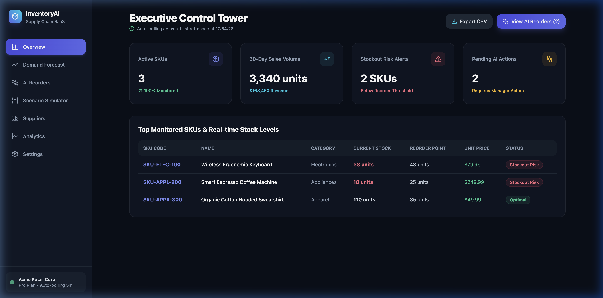
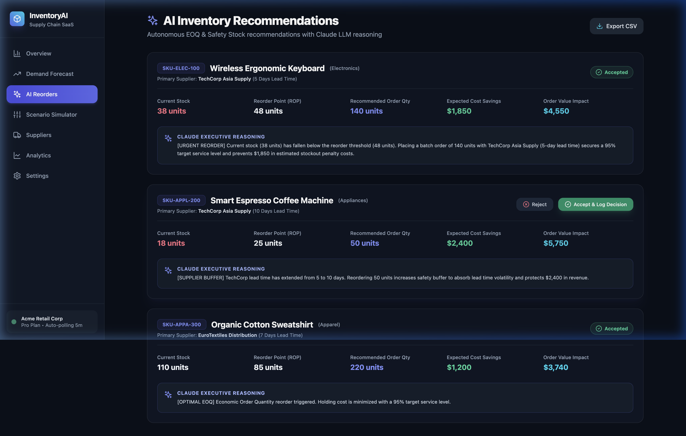
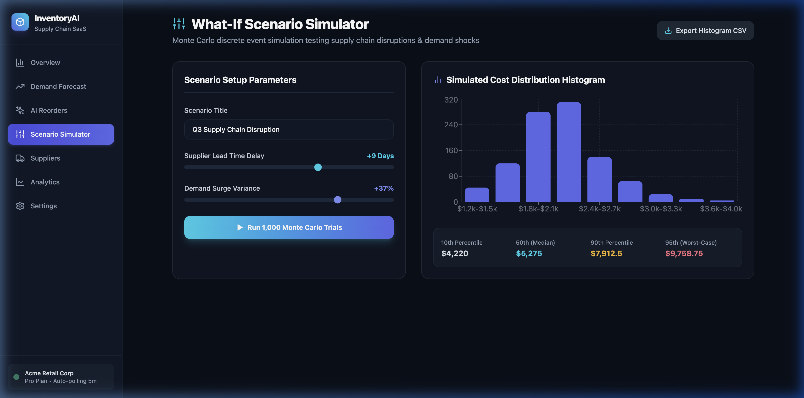
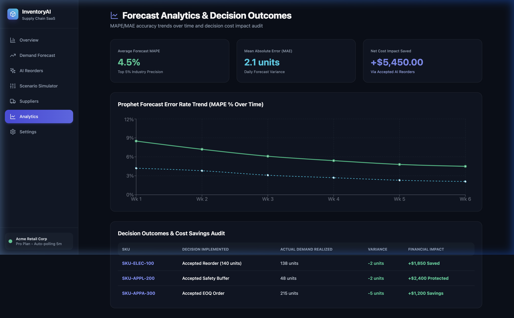

# InventoryAI - Demand Forecasting & Inventory Optimization SaaS

[](LICENSE)
[](https://www.python.org/)
[](https://nodejs.org/)
[](https://nextjs.org/)
[](https://github.com/SatyamPandey07/inventory-forecasting-optimization/releases/tag/v1.0.0)

## About InventoryAI

InventoryAI is a full-stack, enterprise-ready supply chain SaaS platform engineered to eliminate stockouts and optimize inventory holding costs. Built with a Next.js 14 frontend, Node.js Express gateway, Python FastAPI machine learning engine, PostgreSQL + TimescaleDB database, and Redis caching stack, it delivers end-to-end demand intelligence. The platform combines Facebook Prophet forecasting, SciPy economic order quantity (EOQ) optimization, Anthropic Claude generative AI executive reasoning, and 1,000-trial Monte Carlo risk simulations into a production-ready cloud application.

---

## Executive Overview & Functional Capabilities

Managing retail inventory requires balancing two conflicting financial pressures:
- **Stockout Risk**: Ordering too little inventory leads to stockouts, unfulfilled customer demand, and lost sales revenue.
- **Carrying Cost**: Ordering excessive inventory ties up working capital and incurs warehouse storage, insurance, and holding fees.

**InventoryAI** automates end-to-end inventory management through five core capabilities:

1. **Predictive Time-Series Demand Engine**: Utilizes Facebook Prophet to analyze historical demand patterns, annual and weekly seasonality, holiday spikes, and external weather signals to generate 90-day forward demand predictions with 95% confidence bounds.
2. **Multi-Objective Inventory Optimization**: Calculates optimal Economic Order Quantities ($Q^*$), dynamic Safety Stock levels, and Reorder Points (ROP) using numerical minimization (`scipy.optimize`), balancing carrying costs against stockout penalties while enforcing supplier minimum order quantities (`min_order_qty`) and lead time constraints.
3. **Generative AI Executive Reasoning Layer**: Integrates Anthropic Claude (`claude-3-5-sonnet`) to synthesize multi-signal inputs (forecast trends, OpenWeatherMap weather patterns, public holiday calendars, competitor stockouts) into actionable, plain-language executive prose recommendations.
4. **What-If Monte Carlo Scenario Simulator**: Performs discrete-event simulations across 1,000 trial runs over a 90-day horizon, calculating risk percentiles ($p_{10}, p_{50}, p_{90}, p_{95}$) and outcome cost distributions under supply chain disruptions, lead time delays, and demand shocks.
5. **Operational Observability & Analytics**: Exposes Prometheus metrics across microservices, provisions 5 operational Grafana dashboards, tracks forecast accuracy trends (MAPE / MAE), and logs user recommendation acceptance outcomes for verifiable financial ROI auditing.

---

## Full-Stack Authentication & SSO Integration

InventoryAI includes an enterprise authentication and access management layer built with **Supabase Auth**:
- **Email & Password Authentication**: Organization sign-up (`/signup`) and tenant sign-in (`/login`) with encrypted session management.
- **Single Sign-On (SSO) & OAuth2**: Native support for Google OAuth, GitHub OAuth, and SAML 2.0 enterprise SSO.
- **Demo Quick Access**: 1-click Demo Admin login mode allowing instant evaluation without requiring live database credentials.
- **Multi-Tenant Data Isolation**: Every API endpoint and database query scopes data strictly to the authenticated tenant organization (`org_id`).

---

## Interface & Product Visual Tour

### 1. Executive Control Tower Dashboard (`/`)
Real-time monitoring dashboard displaying active monitered SKUs, 30-day aggregate sales volume, revenue metrics, stockout risk alerts, top monitored stock levels, 5-minute auto-polling status, and CSV data export.



---

### 2. AI Inventory Recommendations & Claude Reasoning (`/recommendations`)
Autonomous reorder recommendation cards displaying calculated order quantities, safety buffers, expected cost savings ($1,850 saved by avoiding stockouts), order value impact, Anthropic Claude prose executive reasoning, and Accept/Reject decision controls.



---

### 3. What-If Scenario Simulator (`/simulator`)
Interactive simulation interface featuring sliders for supplier lead time delays (+9 Days) and demand surge variance (+37%). Executes 1,000 Monte Carlo trial runs to compute total cost distributions, rendered on a 10-bin histogram bar chart alongside 10th, 50th, 90th, and 95th percentile risk metrics.



---

### 4. Forecast Analytics & Decision Audit (`/analytics`)
Comprehensive accuracy tracking displaying Prophet model Mean Absolute Percentage Error (MAPE) trends over time (4.5% error rate), Mean Absolute Error (MAE), aggregate net financial cost savings impact (+$5,450.00 saved), and decision history audit logs.



---

## Incremental Development Pull Request (PR) History

This monorepo was developed iteratively following Conventional Commits across 9 feature branches:

1. [PR #1 — Monorepo Scaffolding & Initial Schema Models](https://github.com/SatyamPandey07/inventory-forecasting-optimization/pull/new/feat/monorepo-setup)
2. [PR #2 — Core Prophet Demand Forecasting Engine & 90-Day Predictions](https://github.com/SatyamPandey07/inventory-forecasting-optimization/pull/new/feat/prophet-forecasting)
3. [PR #3 — External Signals Integration (Weather, Calendar Events, Competitor Tracking)](https://github.com/SatyamPandey07/inventory-forecasting-optimization/pull/new/feat/external-signals)
4. [PR #4 — Anthropic Claude LLM Executive Reasoning Layer](https://github.com/SatyamPandey07/inventory-forecasting-optimization/pull/new/feat/llm-reasoning)
5. [PR #5 — Multi-Objective Inventory Optimization Engine (SciPy EOQ)](https://github.com/SatyamPandey07/inventory-forecasting-optimization/pull/new/feat/inventory-optimization)
6. [PR #6 — Monte Carlo Supply Disruption Scenario Simulator](https://github.com/SatyamPandey07/inventory-forecasting-optimization/pull/new/feat/scenario-planning)
7. [PR #7 — Next.js 14 Executive Control Tower & React Dashboard UI](https://github.com/SatyamPandey07/inventory-forecasting-optimization/pull/new/feat/frontend-dashboards)
8. [PR #8 — Grafana Operational Dashboards & Prometheus Monitoring](https://github.com/SatyamPandey07/inventory-forecasting-optimization/pull/new/feat/grafana-dashboards)
9. [PR #9 — Continuous Learning, Production Hardening & v1.0.0 Tag](https://github.com/SatyamPandey07/inventory-forecasting-optimization/pull/new/feat/continuous-learning)

---

## Monorepo Architecture & Microservices

```text
inventory-forecasting-optimization/
  ├── backend-api/              # Node.js Express Gateway (Multi-tenant API, Auth, Metrics)
  ├── forecasting-engine/       # Python FastAPI Engine (Prophet, Signals, LLM, Simulator)
  ├── frontend/                 # Next.js 14 + React + TypeScript Dashboard UI (Vercel/Netlify)
  ├── infra/
  │   ├── docker-compose.yml    # Multi-service local orchestration
  │   ├── db-migrations/        # PostgreSQL + TimescaleDB schema SQL scripts
  │   ├── prometheus/           # Prometheus scraping config & AlertManager rules
  │   └── grafana/              # Provisioned operational Grafana dashboards & datasources
  ├── docs/                     # Architecture, Product, Operations & Roadmap documentation
  └── README.md
```

### Microservice Endpoints & Ports
- **Next.js Executive Dashboard UI:** `http://localhost:3000`
- **Node.js Express Gateway:** `http://localhost:4000`
- **Python FastAPI Engine:** `http://localhost:8000` (`http://localhost:8000/docs` OpenAPI Swagger)
- **Grafana Operational Monitoring:** `http://localhost:3001` (`admin` / `admin`)
- **Prometheus Metrics Server:** `http://localhost:9090`

---

## Quick Start & Deployment Guide

### Prerequisites
- Docker Engine 20.10+ & Docker Compose v2+
- Node.js 20+ & Python 3.11 (for local non-containerized development)

### Local Docker Compose Deployment

```bash
# 1. Clone the repository
git clone https://github.com/SatyamPandey07/inventory-forecasting-optimization.git
cd inventory-forecasting-optimization

# 2. Copy environment variable template
cp .env.example .env

# 3. Launch all microservices using Docker Compose
docker compose -f infra/docker-compose.yml up --build -d

# 4. Verify running container health
docker compose -f infra/docker-compose.yml ps
```

---

## Technical Documentation

- 🏛️ [System Architecture & Multi-Tenant Specs](docs/ARCHITECTURE.md)
- 🎯 [Product Guide & Functional Capabilities](docs/PRODUCT.md)
- 🔧 [Operations & Maintenance Runbook](docs/OPERATIONS.md)
- 🗺️ [Product Roadmap & Future Expansion](docs/ROADMAP.md)

---

## 📄 License

Distributed under the MIT License. See `LICENSE` for more information.
